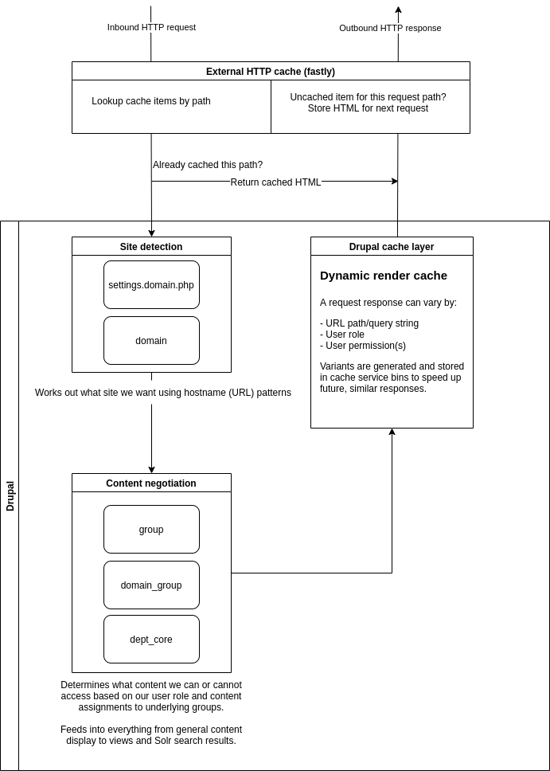
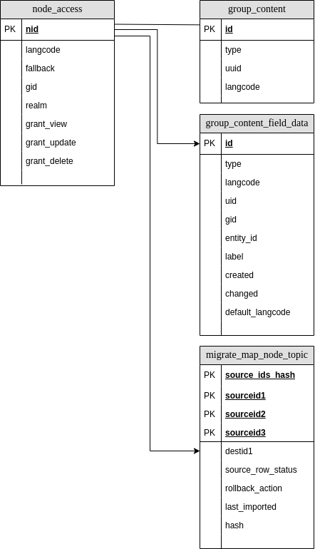

[](https://circleci.com/gh/dof-dss/nicsdru_dept/tree/development)

# Departmental sites codebase

This source code is for the Departmental sites. It is built with Drupal 9 in a single codebase, single database manner using these key contrib modules to control content and access across the sites:

* [group](https://www.drupal.org/project/group) (for entity access control and management)
* [domain](https://www.drupal.org/project/domain) (for hostname negotiation and mapping to group entities)

It is hosted on platform.sh.

Continuous Integration services are provided by [Circle CI](https://github.com/dof-dss/nicsdru_dept/blob/development/.circleci/config.yml).

## Getting started

We recommend Lando for local development. To get started, ensure you have the following installed:

1. Lando [https://docs.devwithlando.io/](https://docs.devwithlando.io/)
2. Composer [https://getcomposer.org/](https://getcomposer.org/)
3. Platform CLI tool [https://docs.platform.sh/development/cli.html](https://docs.platform.sh/development/cli.html)

- Clone this repo
- at the command line, 'cd' into your new directory
- `lando start`

Once this has finished, it is recommended that you download the databases from Platform.sh using the 'platform db:dump'
command.

The 'main' database may be imported into your local Lando site as follows:

`lando db-import <downloaded file name>`

The 'drupal7db' database may be imported into your local Lando site as follows:

`lando db-import -h drupal7db <downloaded file name>`

## Project goals

* Provide non-admin users with an editorial experience that:
  * Masks the complexity around domain/group architecture when operating the site for routine content tasks.
  * Is consistent with NIDirect and Unity sites for editorial tasks, with the exception of form elements to share content across multiple sites.
* Permit rolling content migrations from Drupal 7 for sites yet to launch without irregularities, content id clashes or service interruptions to either D7 or D9 applications.
  * We use D7 UUIDs rather than node ids to help with this, the tradeoff is that a D7 node will have a different node id in D9. This won't affect path aliases but migrate lookups will be needed for any migration plugin config, in favour of verbatim node id values from D7.
  * A D7 site will have a D9 domain + group record from the start. As migrations run, content will be added and updated for all sites. In short: we will get updates for all D7 sites for the migration configurations we have completed, on a rolling basis, until a site is launched on D9.
  * When a site launches to D9, we add the site id to the relevant migration config ignore list.
  * A site launch to D9 will involve (precise steps TBC):
    * Brief content embargo/freeze on D7.
    * DNS record updates, if not already resolving to Platform.sh IPs.
    * Platform.sh application config updates for D7 and D9; routes/domain bindings, for example.
    * Fastly config, as required.
    * Migrate config updates to exclude the new site from rolling D7 content updates.


### Domain hostnames

See `.lando.yml` and the `proxy` configuration section for local hostnames to represent the different sites.

* For administrators, we recommend using `https://dept.lndo.site` for general site administration.
* All other authenticated users should sign in to the site that they are managing content for, eg: `https://finance.lndo.site`

## Site/content negotiation and detection

The project serves content for a number of websites. We can split the process of determining which site is being asked for (detection) and how we isolate and present the content (negotiation).

### Summary of typical request handling



### Site detection

> Which site is being asked for in this request?

We use hostname patterns to determine which site is relevant to a given request. Requests to www.daera-ni.gov.uk and www.executiveoffice-ni.gov.uk both resolve (point) to the same underlying IP address which the services running Drupal are listening to.

By looking at the hostname, we can assess which site we need to use for creating the response. The hostname changes across different application environments, but they are predictable and share a common site id key. See `web/sites/default/settings.domain.php` for how this site id key is detected and used.

#### Production

* Hostname pattern: `https://(www).SITE_ID.gov.uk`
* Configuration files for domain records use this pattern by default.

#### Platform.sh

* Pre-production environments such as: feature branches, edge build, and staging.
* Hostname pattern: `https://SITE_ID.{default}` where `{default}` is the internal, platform.sh specific string. Example: `https://daera-ni.dept-edge-3e7cfpi-dnvkwx4xjhiza.uk-1.platformsh.site`
* See `.platform/routes.yaml` and `web/sites/default/settings.domain.php` for details.

#### Local development

We use Lando for this, see `.lando.yml` for the structure and configuration of the services involved.

* Hostname pattern: `https://SITE_ID.lndo.site`
* See `web/sites/default/settings.domain.php` for how the SITE_ID key is extracted.

### Content negotiation

> What content should be displayed for the current detected site?

Once we have determined the site that a request is being made for, we need to assess how to present content for this. Internally, Drupal uses `domain`, `group` and `domain_group` modules to work out:

* Domain module permits us to identify a site by hostname pattern.
* Group gives us a strong, robust internal framework to isolate content and entities by group type and instance.
* Domain group module bridges the two, somewhat, but we help it along with some custom modules (`web/modules/custom`) and services to bring together domain and group data.

## Migrations

You will need to install modules that start with `Department sites: migration` in order to run migrations to import Drupal 7
content into your Drupal 9 database.

Listing key migrations: `lando drush migrate:status --tag=dept_sites`

NB: migration order is important. The `migrate-scripts/migrate.sh` script outlines the correct sequence of migrations to run and is executed via platform.sh cron every night for a progressive top-up of changes.

> Do NOT use the `--sync` flag on migrate import tasks. This causes a full migration rollback and re-import which can cause confusion for site users, irregularities with other content and can be tricky and time consuming to correct.

There are a number of Drush commands to process migration data.
* etgrm commands handle the translation of Domain to Group content relationships.
* dept:updatelinks updates text fields with internal links and converts to LinkIt format links

### Group content data structures

etgrm commands (`drush etgrm:ra` and `drush etgrm:ca`) can regenerate and repopulate the data tables needed to represent the relationships between nodes and group entities. Details below:



The tables below are key to controlling access to content within groups. ETGRM in particular uses the migrate_map tables to avoid removing data from sites already in production, so it's really important to ensure those migration tables are accurate before beginning.

Examples below reference a D9 topic node with id 89994.
```
TABLE: group_content
>> select * from group_content where id in (select id from group_content_field_data gcfd where entity_id = 89994);
| id  | type                           | uuid                               | langcode |
|-----+--------------------------------+------------------------------------+----------+
|47833|department_site-group_node-topic|ef593db1-ebe9-11ec-a9f7-0242ac140006|en        |

TABLE: group_content_field_data
>> select * from group_content_field_data gcfd where entity_id = 89994;
| id   | type                            | langcode | uid | gid | entity_id | label     | created   | changed   | default_langcode |
|------+---------------------------------+----------+-----+-----+-----------+-----------+-----------+-----------+------------------+
|47833 |department_site-group_node-topic |en        |  1  |  2  |    89994  |Account NI |1655214945 |1655214945 |               1  |

TABLE: node_access
>>> select * from node_access where nid=89994;
|nid  | langcode | fallback | gid     | realm          | grant_view | grant_update | grant_delete |
|-----+----------+----------+---------+----------------+------------+--------------+--------------+
|89994|en        |       1  |10261667 |group_domain_id |         1  |           0  |           0  |

TABLE: migrate_map_node_topic
>> select * from migrate_map_node_topic where destid1 = 89994;
|source_ids_hash                                                 |sourceid1                           |sourceid2|sourceid3|destid1|source_row_status|rollback_action|last_imported|hash                                                            |
|----------------------------------------------------------------+------------------------------------+---------+---------+-------+-----------------+---------------+-------------+----------------------------------------------------------------+
|3affdd1842156be372716d598a8177dac51241616a9c16efd09afbe3dcc30b30|46d4b385-aafa-4d3c-a98b-84cc7e31e583|     2898|7        |  89994|                0|              0|            0|ca8d8226b21eac95f735d49159e5ac37030544190569b1a5b10b91a921eb78bb|
```

The stored procedures used by ETGRM to generate these values create temporary tables:

```
TABLE: group_relationships
>> select * from group_relationships where nid=89994;
id   |nid  |gid|gc_type                         |label     |
-----+-----+---+--------------------------------+----------+
65413|89994|  2|department_site-group_node-topic|Account NI|

TABLE: domain_ids
>> select * from domain_ids;
id|domain_id|
--+---------+
 1|  4567776|
 2| 10261667|
 3|  2853218|
 4|  3070245|
 5| 10077412|
 6|  4252327|
 7| 16252774|
 8|  4866601|
 9| 16605160|
10|  8363580|
```

> **Note:**
> * domain_id values are randomised integer values, generated by domain_group module, in order to bridge group entity ids and domain ids.
> * domain_ids.id == group id/gid.
> * domain_access.gid == domain_ids.domain_id

### Points of interest

* Views and other things that rely on entity API are able to use entity access rules in conjunction with user permissions to determine whether a node can be seen on a given site. Pros: it happens without the need for explicit filters to be added to views config or entity queries. Cons: it can be confusing if viewing the site as a user with an administrative role as it will usually bypass usual access conditions.
* Revisions: these are deemed too complex to track/import on a rolling basis. Access to older content will be available on the D7 application, running on platform.sh on an internal hostname.
* Negative numbers of unprocessed source items: This sometimes occurs when source items (in D7) are removed. The removals are not replicated on the destination (D9) resulting in a natural imbalance to the way unprocessed items are calculated by Migrate API. This is acknowledged/documented here: https://www.drupal.org/project/migrate_tools/issues/2843383. It is possible to re-sync the counts with the `--sync` flag but this isn't recommended, as the process involes a full rollback (removal of prior migrated D9 content) followed by a full import. This can be very time consuming and result in a confusing experience for any site users. It could also lead to inconsistencies in data if executed in an incorrect sequence. **Where possible, irregularities should be investigated on a case-by-case basis and a bulk update or sync operation carried out where there is a clear trend or pattern of inconsistencies to correct.**
